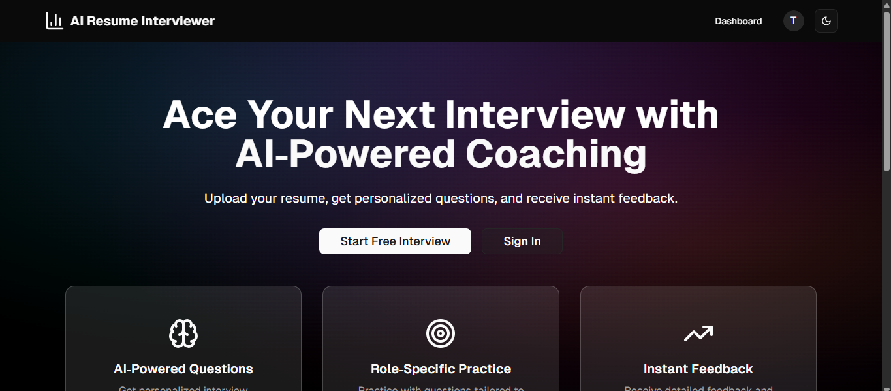
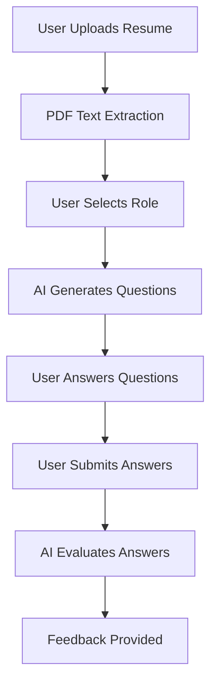
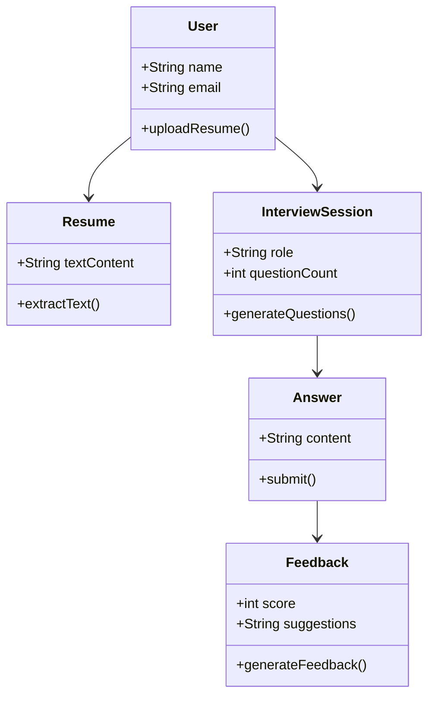

# arii-AI Interview Coach

## Overview
A comprehensive AI-powered interview coaching platform that helps users prepare for technical and behavioral interviews by analyzing their resume and generating personalized interview questions.

## Features
- **Resume Upload & Analysis**: Extracts text from PDF resumes to provide context to the AI
- **Role Selection**: Users can select the role they're targeting for interview preparation
- **Question Generation**: AI (Gemini) generates technical and behavioral questions based on the user's resume and selected role
- **Answer Evaluation**: AI reviews submitted answers and provides:
  - Scores
  - Detailed feedback
  - Insights
  - Suggested improvements
  - Model answers

## Tech Stack
- **Frontend**: Next.js, shadcn
- **Backend**: Firebase
- **Cloud Storage**: Cloudinary
- **AI**: Google Gemini

## Team Members
- Sanju Shaw
- Priyanshu Shaw
- Sayan Dolui

## Project Flow
1. User uploads resume (PDF)
2. System extracts text from PDF
3. User selects target role and number of questions
4. AI generates interview questions
5. User answers questions
6. User submits answers
7. AI evaluates answers and provides feedback

## Setup Instructions
1. Clone the repository
2. Install dependencies: `pnpm install`
3. Configure Firebase and Cloudinary credentials
4. Run the development server: `pnpm run dev`

## Architecture Diagram

## UML Class Diagram

## Contact
For any inquiries, please contact the team members listed above.